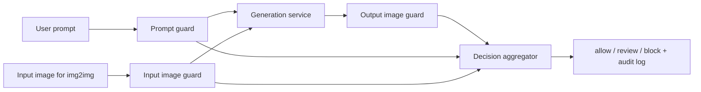

# Image Censorship Module

MLSecOps guardrail module for image generation pipelines. The module checks
text prompts, input images for img2img flows, and final generated images. It
returns a machine-readable verdict, violated category, detector evidence, and a
human-readable rationale.

The default local profile is intentionally lightweight enough for a MacBook:

- `Falconsai/nsfw_image_detection` as a fast NSFW image classifier.
- a local keyword prompt guard for obvious high-risk prompt requests.
- optional `AIML-TUDA/LlavaGuard-v1.2-0.5B-OV-hf` for stronger image reasoning.
- optional `google/shieldgemma-2-4b-it` for stronger gated image safety checks.

## Architecture



The censor module must run as an independent service in front of and behind the
generator. The generator is not trusted to make policy decisions about its own
outputs.

## Quick Start

Install everything into a project-local virtual environment:

```bash
scripts/install_local.sh
```

Start the local API:

```bash
scripts/run_local_api.sh
```

Open the interactive API docs:

```text
http://127.0.0.1:8000/docs
```

Check service health:

```bash
curl http://127.0.0.1:8000/health
```

Run a prompt check from the terminal:

```bash
curl -X POST http://127.0.0.1:8000/v1/censor \
  -F 'prompt=make a realistic promo image for a bank card'
```

Run an image check from the terminal:

```bash
curl -X POST http://127.0.0.1:8000/v1/censor \
  -F 'output_image=@./samples/generated.png'
```

Dry-run the CLI without downloading models:

```bash
.venv/bin/img-censor --config configs/local.yaml --prompt "safe banking banner" --mock
```

Pre-download enabled local models:

```bash
.venv/bin/python scripts/download_models.py --config configs/local.yaml
```

Use the fuller local model profile:

```bash
IMG_CENSOR_CONFIG=configs/pipeline.yaml scripts/run_local_api.sh
```

Use a stricter CLI profile by lowering the block threshold:

```bash
.venv/bin/img-censor --config configs/local.yaml --output-image ./image.png --block-threshold 0.55
```

Evaluate a CSV manifest:

```bash
.venv/bin/python scripts/evaluate_manifest.py examples/eval_manifest.example.csv --config configs/local.yaml
```

## Project Layout

```text
configs/local.yaml             Mac-friendly default runtime profile
configs/pipeline.yaml          Fuller runtime model registry and thresholds
docs/architecture.md           End-to-end pipeline design
docs/taxonomy.md               Prohibited content taxonomy
docs/threat-model.md           MLSecOps threat model
docs/model-selection.md        Lightweight model choices for MacBook M4
docs/model-review.md           Open detector review and tradeoffs
docs/evaluation-methodology.md Metrics and benchmark plan
docs/unresolved-risks.md       Remaining production hardening risks
docs/demo-script.md            Demo flow for the defense
docs/criteria-checklist.md     Mapping from case criteria to artifacts
reports/baseline-metrics.md    Baseline local metrics report
src/img_censor/                Pipeline implementation
src/img_censor/__main__.py     Allows python -m img_censor CLI usage
scripts/install_local.sh       Create .venv and install local dependencies
scripts/run_local_api.sh       Start the local FastAPI service
tests/                         Tests that do not download models
models/hf-cache/               Local Hugging Face cache, contents ignored
samples/                       Local demo images, contents ignored
```

## Notes

The API runs fully on your machine. The first real image check may download an
enabled Hugging Face model into `models/hf-cache`; after that, inference uses
the local cache. ShieldGemma 2 is kept optional because the model is gated and
requires accepting the Google Gemma license.
