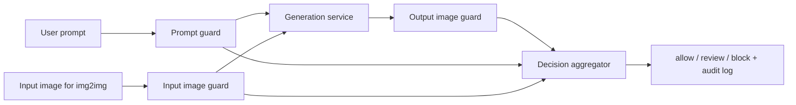

# Image Censorship Module

MLSecOps guardrail module for image generation pipelines. The module checks
text prompts, input images for img2img flows, and final generated images. It
returns a machine-readable verdict, violated category, detector evidence, and a
human-readable rationale.

The default profile is intentionally lightweight enough for a MacBook M4:

- `AIML-TUDA/LlavaGuard-v1.2-0.5B-OV-hf` as the main VLM safety judge.
- `Falconsai/nsfw_image_detection` as a fast NSFW image classifier.
- `MoritzLaurer/multilingual-MiniLMv2-L6-mnli-xnli` as a prompt zero-shot guard.
- Optional `google/shieldgemma-2-4b-it` as a stronger gated image safety model.

## Architecture



The censor module must run as an independent service in front of and behind the
generator. The generator is not trusted to make policy decisions about its own
outputs.

## Quick Start

```bash
python3 -m venv .venv
source .venv/bin/activate
pip install -U pip
pip install -e .
```

Dry-run the pipeline without downloading models:

```bash
img-censor --config configs/pipeline.yaml --prompt "safe banking banner" --mock
```

Run real local checks. The first run downloads the selected Hugging Face models:

```bash
img-censor \
  --config configs/pipeline.yaml \
  --prompt "make a realistic promo image for a bank card" \
  --output-image ./samples/generated.png
```

Pre-download enabled lightweight models:

```bash
PYTHONPATH=src python scripts/download_models.py --config configs/pipeline.yaml
```

Use a stricter profile by lowering the block threshold:

```bash
img-censor --config configs/pipeline.yaml --output-image ./image.png --block-threshold 0.55
```

Evaluate a CSV manifest:

```bash
PYTHONPATH=src python scripts/evaluate_manifest.py examples/eval_manifest.example.csv --config configs/pipeline.yaml
```

## Project Layout

```text
configs/pipeline.yaml          Runtime model registry and thresholds
docs/architecture.md           End-to-end pipeline design
docs/taxonomy.md               Prohibited content taxonomy
docs/threat-model.md           MLSecOps threat model
docs/model-selection.md        Lightweight model choices for MacBook M4
src/img_censor/                Pipeline implementation
tests/                         Tests that do not download models
```

## Notes

LlavaGuard is the default reasoning layer because the 0.5B HF version is small
and provides a safety category plus rationale. ShieldGemma 2 is kept optional:
it is stronger for its three native policies, but the model is gated and 4B.
