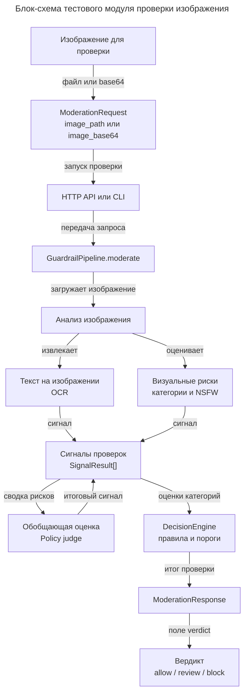

# Блок-схема тестового модуля проверки изображения

Эта диаграмма выделяет нашу часть решения: тестовый модуль принимает изображение, прогоняет его через проверки и возвращает вердикт `allow`, `review` или `block`. Схема намеренно укрупнена для бизнес-чтения, но сохраняет ключевые технические сущности: `ModerationRequest`, `GuardrailPipeline`, `SignalResult`, `DecisionEngine` и `ModerationResponse`.

## Комментарии к блокам

| Блок | Что означает |
|---|---|
| Изображение для проверки | Входной объект модуля: картинка, которую нужно оценить. |
| `ModerationRequest` | Технический контракт входа. Изображение передается как путь к файлу `image_path` или как `image_base64`. |
| HTTP API или CLI | Две точки запуска одного и того же тестового модуля: через сервисный API или командную строку. |
| `GuardrailPipeline.moderate` | Основной оркестратор проверки: принимает запрос, запускает анализ и собирает результаты. |
| Анализ изображения | Укрупненный блок всех проверок, которые смотрят на содержимое картинки. |
| Текст на изображении / OCR | Извлекает текст, если он есть на картинке, чтобы его тоже можно было учитывать в решении. |
| Визуальные риски / категории и NSFW | Проверяет визуальное содержимое: запрещенные категории, откровенный контент и другие риск-сигналы. |
| Обобщающая оценка / Policy judge | Сводит сигналы проверок и добавляет общий риск-сигнал. |
| `SignalResult[]` | Единый формат результатов от проверок: имя проверки, статус, категории, оценки и пояснения. |
| `DecisionEngine` | Применяет правила и пороги, чтобы из набора сигналов получить итоговое решение. |
| `ModerationResponse` | Полный структурированный ответ модуля: вердикт, категории, confidence, evidence, signals и notes. |
| Вердикт | Главный бизнес-результат: `allow`, `review` или `block`. |

## Комментарии к связям

| Связь | Что означает |
|---|---|
| файл или base64 | Изображение можно передать как локальный путь или как строку base64. |
| запуск проверки | Запрос уходит в один из интерфейсов запуска: API или CLI. |
| передача запроса | Интерфейс не принимает решение сам, а передает данные в пайплайн. |
| загружает изображение | Пайплайн приводит вход к формату, пригодному для проверок. |
| извлекает | OCR-дорожка достает текст с изображения. |
| оценивает | Визуальная дорожка оценивает риски по картинке. |
| сигнал | Каждая проверка возвращает не финальное решение, а отдельный сигнал риска. |
| сводка рисков | Policy judge получает собранные сигналы и смотрит на них совместно. |
| итоговый сигнал | Policy judge добавляет собственную оценку к общему набору сигналов. |
| оценки категорий | DecisionEngine получает scores по категориям риска. |
| итог проверки | Результат правил и порогов оформляется как `ModerationResponse`. |
| поле verdict | Из полного ответа выделяется основной результат для бизнеса: разрешить, отправить на review или заблокировать. |
