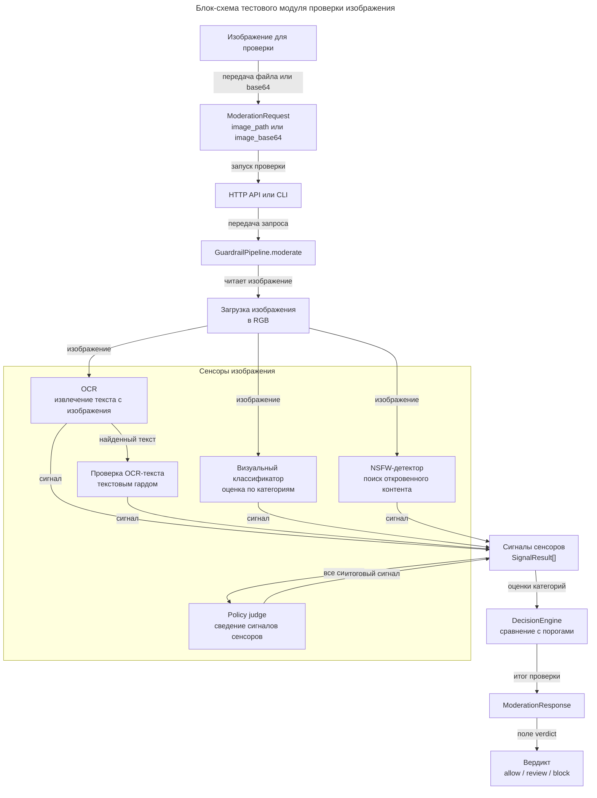

# Блок-схема тестового модуля проверки изображения

Эта диаграмма выделяет только нашу часть решения: локальный модуль, который принимает изображение на вход и возвращает вердикт `allow`, `review` или `block`. Она не описывает внешний продуктовый контур генерации изображений, а фокусируется на устройстве MVP-модуля `censor_guard`.

## Комментарии к блокам

| Блок | Что означает |
|---|---|
| Изображение для проверки | Входной объект тестового модуля: локальный файл или изображение, переданное как base64. |
| `ModerationRequest` | Единый контракт входа. Для проверки изображения используются `image_path` или `image_base64`; остальные поля задают сценарий, стадию и метаданные. |
| HTTP API или CLI | Две точки запуска одного и того же модуля: `POST /v1/moderate` или `python -m censor_guard.cli`. |
| `GuardrailPipeline.moderate` | Центральный оркестратор: загружает изображение, вызывает сенсоры и передает их сигналы в движок решений. |
| Загрузка изображения в RGB | Приводит вход к единому формату изображения, чтобы все адаптеры работали с одинаковыми данными. |
| OCR | Извлекает текст, если он присутствует на изображении. Сам OCR не выносит вердикт, а только возвращает найденный текст и служебный сигнал. |
| Проверка OCR-текста текстовым гардом | Прогоняет найденный OCR-текст через текстовый гард. В текущем MVP это заглушка, но место интеграции уже выделено. |
| Визуальный классификатор | Оценивает изображение по категориям таксономии через visual-модель. |
| NSFW-детектор | Отдельно проверяет откровенный контент специализированной моделью. |
| Policy judge | Получает собранные сигналы и добавляет обобщающую оценку. Сейчас работает эвристика, позднее сюда можно подключить мультимодальную модель. |
| `SignalResult[]` | Единый список результатов от сенсоров. Каждый элемент содержит имя сенсора, статус, категории, оценки и пояснение. |
| `DecisionEngine` | Сравнивает оценки категорий с порогами `review` и `block`, учитывает hard/soft категории и формирует итог. |
| `ModerationResponse` | Структурированный ответ модуля: вердикт, категории, confidence, reason, evidence, signals и notes. |
| Вердикт | Главный результат тестового модуля: `allow`, `review` или `block`. |

## Комментарии к связям

| Связь | Что означает |
|---|---|
| передача файла или base64 | Изображение попадает в модуль либо как путь к файлу, либо как base64-строка. |
| запуск проверки | Входные данные оборачиваются в `ModerationRequest` и отправляются в API или CLI. |
| передача запроса | API/CLI не принимают решение сами, а передают запрос в `GuardrailPipeline`. |
| читает изображение | Пайплайн загружает изображение перед запуском визуальных сенсоров. |
| изображение | Один и тот же нормализованный image-объект передается в OCR, визуальный классификатор и NSFW-детектор. |
| найденный текст | OCR-текст отдельно отправляется в текстовый гард. |
| сигнал | Каждый сенсор возвращает `SignalResult`, а не финальный вердикт. |
| все сигналы | Policy judge получает весь список сигналов, чтобы оценивать их совместно. |
| итоговый сигнал | Policy judge добавляет свой `SignalResult` к общему набору. |
| оценки категорий | `DecisionEngine` получает категории и scores от всех успешных сенсоров. |
| итог проверки | Движок решений формирует `ModerationResponse`. |
| поле verdict | Из полного ответа отдельно выделяется основной результат: `allow`, `review` или `block`. |
