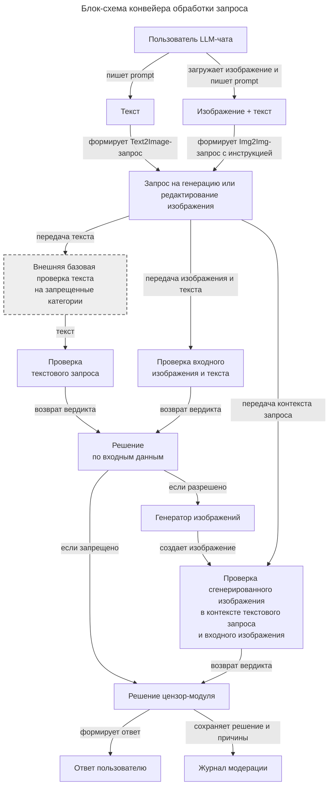

# Блок-схема конвейера обработки запроса

Диаграмма показывает, как запрос на генерацию или редактирование изображения проходит через цензор-модуль: от выбора входных данных пользователем до ответа пользователю и записи решения в журнал модерации.



## Описание блоков

| Блок | Что означает |
|---|---|
| Пользователь LLM-чата | Человек, который отправляет запрос на генерацию изображения через чатовый интерфейс. |
| Текст | Сценарий `Text2Image`: пользователь пишет текстовое описание, по которому нужно создать изображение. |
| Изображение + текст | Сценарий `Img2Img` с инструкцией: пользователь загружает изображение и текстом описывает нужное изменение. |
| Запрос на генерацию или редактирование изображения | Единая техническая форма запроса: prompt, negative prompt, входное изображение при `Img2Img`, сценарий операции и связанный контекст. |
| Внешняя базовая проверка текста на запрещенные категории | Внешний фильтр текста, не относящийся к зоне ответственности цензор-модуля. На диаграмме отмечен серым цветом и пунктирной рамкой. |
| Проверка текстового запроса | Внутренняя проверка текстовой части запроса цензор-модулем. |
| Проверка входного изображения и текста | Внутренняя проверка входного изображения вместе с текстовой инструкцией для сценария `Img2Img`. |
| Решение по входным данным | Объединяет результаты входных проверок и решает, можно ли передавать запрос генератору. |
| Генератор изображений | Модель или внешний сервис, который создает изображение по разрешенному запросу. |
| Проверка сгенерированного изображения в контексте текстового запроса и входного изображения | Проверяет результат генерации с учетом исходного текстового запроса и входного изображения при `Img2Img`. |
| Решение цензор-модуля | Объединяет сигналы проверок и выбирает исход: выдать результат, отказать или отправить на ручную проверку. |
| Ответ пользователю | То, что получает пользователь: изображение, отказ или сообщение о ручной проверке. |
| Журнал модерации | Техническая запись решения: `request_id`, категории риска, scores, причины, hashes и версия правил. |

## Экспорт

```powershell
npx @mermaid-js/mermaid-cli -i docs/diagrams/architecture_overview_vertical.mmd -o docs/diagrams/architecture_overview_vertical_4x.png -s 4
npx @mermaid-js/mermaid-cli -i docs/diagrams/architecture_overview_vertical.mmd -o docs/diagrams/architecture_overview_vertical.svg
```
