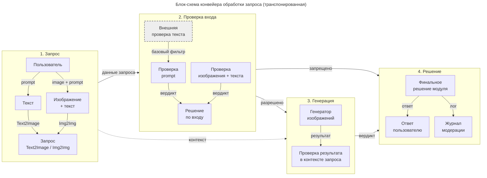

# Блок-схема конвейера обработки запроса (транспонированная)

```mermaid
---
title: Блок-схема конвейера обработки запроса (транспонированная)
---
%%{init: {"flowchart": {"nodeSpacing": 22, "rankSpacing": 34, "curve": "basis", "htmlLabels": true}, "themeVariables": {"fontSize": "18px"}}}%%
flowchart LR
  subgraph requestPhase["1. Запрос"]
    direction TB
    user["Пользователь"]
    textInput["Текст"]
    mixedInput["Изображение<br/>+ текст"]
    request["Запрос<br/>Text2Image / Img2Img"]

    user -->|"prompt"| textInput
    user -->|"image + prompt"| mixedInput
    textInput -->|"Text2Image"| request
    mixedInput -->|"Img2Img"| request
  end

  subgraph inputPhase["2. Проверка входа"]
    direction TB
    externalTextCheck["Внешняя<br/>проверка текста"]
    textCheck["Проверка<br/>prompt"]
    imageTextCheck["Проверка<br/>изображения + текста"]
    inputDecision["Решение<br/>по входу"]

    externalTextCheck -->|"базовый фильтр"| textCheck
    textCheck -->|"вердикт"| inputDecision
    imageTextCheck -->|"вердикт"| inputDecision
  end

  subgraph generationPhase["3. Генерация"]
    direction TB
    generator["Генератор<br/>изображений"]
    outputContextCheck["Проверка результата<br/>в контексте запроса"]

    generator -->|"результат"| outputContextCheck
  end

  subgraph decisionPhase["4. Решение"]
    direction TB
    decision["Финальное<br/>решение модуля"]
    response["Ответ<br/>пользователю"]
    audit["Журнал<br/>модерации"]

    decision -->|"ответ"| response
    decision -->|"лог"| audit
  end

  requestPhase -->|"данные запроса"| inputPhase
  inputPhase -->|"разрешено"| generationPhase
  inputPhase -->|"запрещено"| decisionPhase
  requestPhase -.->|"контекст"| generationPhase
  generationPhase -->|"вердикт"| decisionPhase

  classDef external fill:#eeeeee,stroke:#777777,stroke-width:2px,stroke-dasharray:6 4,color:#333333;
  class externalTextCheck external;
```
