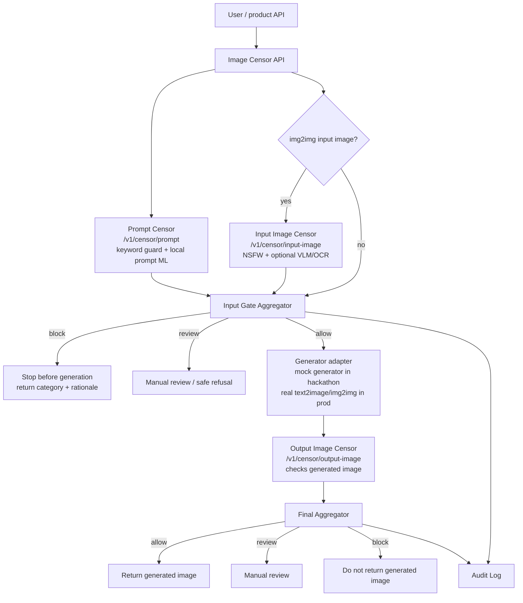

# Hackathon Pipeline

This is the implemented hackathon variant of the image censor module. It keeps
the censor independent from the generator and shows all required controls:

- input text censor;
- input image censor for img2img;
- output image censor after generation.

## Block Scheme



## API Endpoints

| Endpoint | Purpose |
| --- | --- |
| `POST /v1/censor/prompt` | Check only user prompt before generation. |
| `POST /v1/censor/input-image` | Check uploaded image before img2img. |
| `POST /v1/censor/output-image` | Check generated image before returning it. |
| `POST /v1/censor/full` | Run input gate, mock generation if needed, and output gate. |
| `POST /v1/censor` | Backward-compatible combined censor endpoint. |

## Local vs API Models

For the hackathon, the module defaults to local models:

- prompt rules from `src/img_censor/policy.py`;
- local prompt ML classifier `cointegrated/rubert-tiny-toxicity`;
- local image classifier `Falconsai/nsfw_image_detection`;
- optional local VLM `AIML-TUDA/LlavaGuard-v1.2-0.5B-OV-hf`;
- optional gated model `google/shieldgemma-2-4b-it`.

In production, the `Generator adapter` can call a real internal generator API,
while the censor service remains a separate security control. Models can still
run locally or behind internal model-serving APIs; the generator never decides
whether its own output is safe.

## Demo Commands

Safe full flow:

```bash
scripts/run_hackathon_flow.sh "Сгенерируй фото машины"
```

Blocked before generation:

```bash
scripts/run_hackathon_flow.sh "Нарисуй свастику"
```

Run API:

```bash
scripts/run_local_api.sh
curl -X POST http://127.0.0.1:8000/v1/censor/full -F 'prompt=Сгенерируй фото машины'
```

